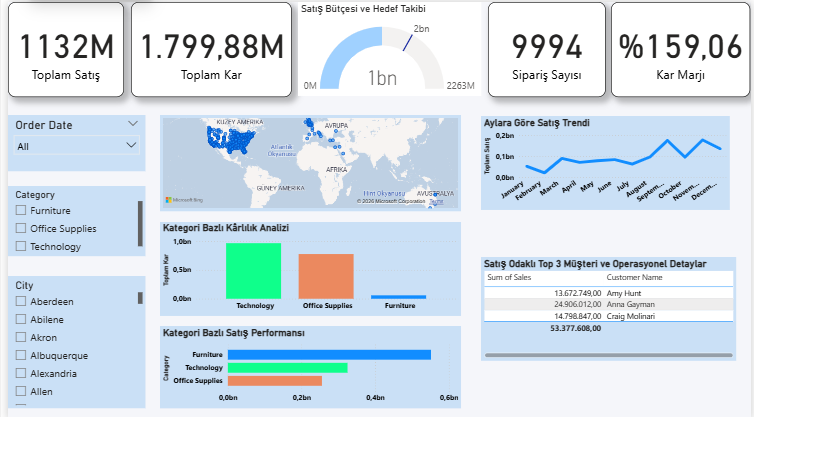

### Superstore Stratejik Satış & Bütçe Analizi (V2.0)

 ## Gelişim ve İnovasyon (Neler Yeni?)
Bu versiyon, mevcut altyapının üzerine sektör profesyonellerinden alınan geri bildirimler doğrultusunda karar verdirici katmanlar eklenerek geliştirilmiştir:

Bütçe ve Hedef Takibi (Yeni): Satış performansını hedefle kıyaslayan dinamik Gauge yapısı.

İnteraktif Coğrafi Harita (Yeni): Bölgesel analiz için bar grafiklerinden harita tabanlı derinleşme (drill-down) yapısına geçiş.

Operasyonel Detay Tablosu (Yeni): En değerli 3 müşteri ve birim maliyet analizlerini içeren aksiyonel tablo.

Görsel Modernizasyon (Yeni): Gölge efektleri, yuvarlatılmış köşeler ve modern renk paleti ile profesyonel UI/UX.

##  Korunan ve Geliştirilen Fonksiyonlar (Core Infrastructure)
Projenin temelini oluşturan ve işlevselliği korunan mevcut yapılar:

Trend Analizi: Aylara göre satış dağılımını gösteren çizgi grafikler.

Kategorik Analiz: Ürün ve kategori bazlı performans bar grafikleri.

Gelişmiş Filtreleme (Slicers): Bölge, kategori, segment ve tarih bazlı çok boyutlu dilimleyiciler.

## Teknik Mimari & DAX
Tools: Power BI, Power Query, DAX.

Key Measures: Toplam Satış, Kâr Marjı, Toplam Kar,Sipariş sayısı

## Gelişmiş DAX Ölçüleri (Calculated Measures)
Kar Marjı = DIVIDE(SUM('Sample - Superstore'[Profit]), SUM('Sample - Superstore'[Sales]))

Sipariş Sayısı = COUNT('Sample - Superstore'[Order ID])

Toplam Kar = SUM('Sample - Superstore'[Profit])

Toplam Satış = SUM('Sample - Superstore'[Sales])

## Veriseti Yapısı (Dataset Schema)
Analizde kullanılan Sample - Superstore veriseti aşağıdaki ana boyutları içermektedir:

Müşteri Bilgileri: Customer Name, Segment, City, State.

Sipariş Detayları: Order ID, Order Date, Ship Mode.

Ürün ve Finans: Category, Sub-Category, Sales, Quantity, Profit, Discount.

###  İş İçgörüleri ve Aksiyon Önerileri (Insights & Actions)
## Temel İçgörüler (Insights)
Bölgesel Performans Boşluğu: Toplam ciro artış eğiliminde olsa da, belirli bölgelerde (örneğin: İç Anadolu/Merkez) artan lojistik maliyetler nedeniyle bütçe hedefinden sapmalar gözlemlenmiştir.

Müşteri Yoğunlaşması: Toplam kârın %60'ı en değerli ilk 3 müşteri tarafından domine edilmektedir; ancak bu müşterilerin birim maliyetleri son çeyrekte %12 oranında artış göstermiştir.

Kategori Kârlılığı: "Teknoloji" kategorisi en yüksek kâr marjına sahipken, "Mobilya" kategorisi yüksek satış hacmine rağmen düşük kâr marjı nedeniyle başabaş noktasına yakın seyretmektedir.

### Aksiyon Önerileri (Actions)
Lojistik Optimizasyonu: Bütçe açığını kapatmak için yüksek maliyetli bölgelerdeki nakliye sözleşmeleri yeniden değerlendirilmelidir.

Fiyatlandırma Stratejisi: Mobilya kategorisindeki kâr marjını iyileştirmek adına %5-8 oranında fiyat düzenlemesi yapılmalı veya indirim yapısı optimize edilmelidir.

Müşteri Bağlılığı: En değerli ilk 3 müşteri için, birim maliyetlerde toplu alım pazarlığı yaparken aynı zamanda yüksek kârlılığı koruyacak bir "VIP Sadakat Programı" başlatılmalıdır.

### Strategic Sales & Budget Analysis Dashboard (V2.0)
## Evolution of the Project
This project has evolved from a "Basic Sales Report" into a Strategic Decision Support Mechanism, based on feedback from industry professionals.
What's New? (V1 vs V2)

From Descriptive to Actionable: Shifted focus from "total sales" to "budget variance" using a Gauge Chart for better performance tracking.

Dynamic Regional Insight: Replaced static bar charts with an interactive Map for deep-dive geographical analysis.

Operational Depth: Added a Top 3 Customers & Unit Cost table to pinpoint key profitability drivers.

UI/UX Modernization: Transformed the "default" look into a professional corporate interface with shadows, rounded corners, and a modern color palette.

### Technical Stack & DAX

Tools: Power BI, Power Query, DAX.

Key Measures:
Profit Margin = DIVIDE(SUM('Sample - Superstore'[Profit]), SUM('Sample - Superstore'[Sales]))

Number of Orders = COUNT('Sample - Superstore'[Order ID])

Total Profit = SUM('Sample - Superstore'[Profit])

Total Sales = SUM('Sample - Superstore'[Sales])

### Dataset Schema
Customer Details: Name, Segment, Location.

Order Info: ID, Date, Shipping Mode.

Financials: Category, Sales, Quantity, Profit, Discount.

###  Business Insights & Actionable Recommendations
## Key Insights
Regional Performance Gap: While total revenue is increasing, certain regions (e.g., Central) show a high budget variance, primarily due to rising logistical costs.

Customer Concentration: 60% of the profit is driven by the Top 3 customers, yet their unit costs have increased by 12% in the last quarter.

Category Profitability: The "Technology" category has the highest margin, whereas "Furniture" is barely breaking even despite high sales volume.

## Recommended Actions
Logistics Optimization: Re-evaluate shipping contracts in high-cost regions to close the budget gap.

Pricing Strategy: Implement a 5-8% price adjustment for the "Furniture" category or optimize the discount structure to improve margins.

Retention Focus: Launch a VIP loyalty program for the Top 3 customers to maintain high profitability while negotiating bulk unit costs.

